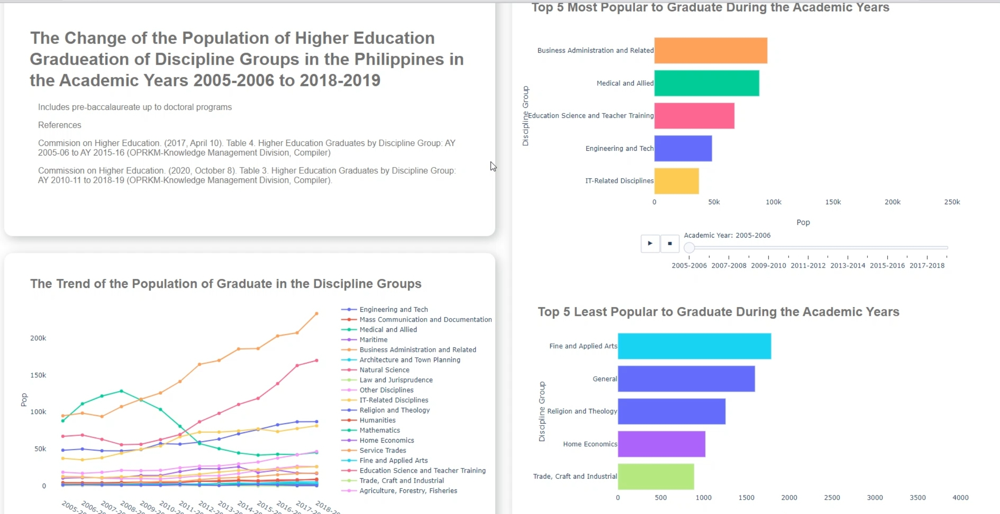

# The Change in Higher Education Graduates in the A.Y. 2005-2006 to 2018-2019

## Installation

The program is made using python. The following are the library used in the program that should be installed first in you system:

> * Numpy
> * Pandas
> * Plotly
> * Dash
> * Cufflinks

<br>

Hosting a local server in your system:

```
python Code.py 
```
<br>




### References

Commision on Higher Education. (2017, April 10). *Table 4. Higher Education Graduates by Discipline Group: AY 2005-06 to AY 2015-16*(OPRKM-Knowledge Management Division, Compiler).

Commission on Higher Education. (2020, October 8).*Table 3. Higher Education Graduates by Discipline Group: AY 2010-11 to 2018-19*(OPRKM-Knowledge Management Division, Compiler).
